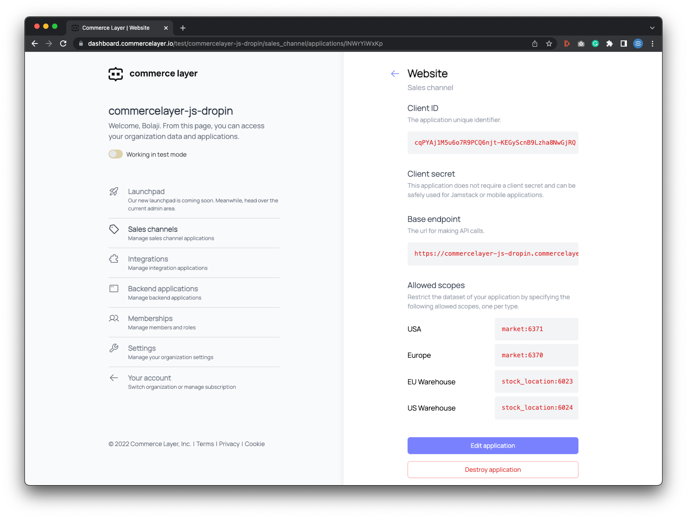

# Commerce Layer JS Drop-in

A JavaScript library that helps you integrate the [Commerce Layer API](https://docs.commercelayer.io/api/) into any HTML page.


## What is Commerce Layer?

[Commerce Layer](https://commercelayer.io) is a multi-market commerce API and order management system that lets you add global shopping capabilities to any website, mobile app, chatbot, wearable, voice, or IoT device, with ease. Compose your stack with the best-of-breed tools you already mastered and love. Make any experience shoppable, anywhere, through a blazing-fast, enterprise-grade, and secure API.

## How it works

Commerce Layer JS Drop-in lets you transform any plain HTML page into an enterprise-grade static commerce website, with almost **no coding required**. All you need to do is embed the library and tag the HTML page following some conventions (i.e., class names and SKU codes). Prices, availability messages, shopping bag, and any other commerce functionality are automatically mixed into your own content and styling, whatever the CMS, SSG, and tools you use to build your site pages.

As a reference, feel free to check the HTML code of the sample [category](/demo/category-page.html), [product (select)](/demo/product-page-select.html), and [product (radio)](/demo/product-page-radio.html) pages in the `demo` folder of this repository or preview the demos [here](https://commercelayer-js-dropin-demos.vercel.app/).

---

## Table of contents

1. [Getting Started](#getting-started)
2. [API credentials](#api-credentials)
3. [Configuration](#configuration)
4. [Static content](#static-content)
5. [Prices](#prices)
6. [Availability messages](#availability-messages)
7. [Add to bag buttons](#add-to-bag-buttons)
8. [Variant options](#variant-options)
9. [Shopping bag](#shopping-bag)
10. [Checkout button](#checkout-button)
11. [Document events](#document-events)
12. [Custom checkout, customer accounts, and more](#custom-checkout-customer-accounts-and-more)
13. [Contributors guide](#contributors-guide)
14. [Help and support](#need-help?)
15. [License](#license)

---

## Getting started

Download and include the [JavaScript file](./lib/index.js) in your project or use the CDN below:

```
https://cdn.jsdelivr.net/npm/@commercelayer/js-dropin@1.5.12/lib/index.js
```

### API Credentials

1. Head to [https://dashboard.commercelayer.io/sign_up](https://dashboard.commercelayer.io/sign_up) to create a free developer account. 
2. Create a new [organization](https://commercelayer.io/docs/data-model/users-and-organizations/) for your business.
3. Upon creating your organization, you can opt to seed your organization with test data through the [Commerce Layer CLI](https://github.com/commercelayer/commercelayer-cli).
4. In your Commerce Layer dashboard, click on the **Sales channels** tab and create an application, with the name: `Website`. Upon successful creation, you'll get a `CLIENT ID` and `ENDPOINT`. Kindly remember to save that as you will need them to interact with your application. Below that, you will also find the *ALLOWED SCOPES* section



### Configuration

Add an element with `clayer-config` ID and populate its data attributes with your credentials and page preferences. Then add a script link to import the library right before the closing body tag:

```html
<!DOCTYPE html>
<html>
  <head></head>
  <body>
    <!-- Config -->
    <div
      id="clayer-config"
      data-base-url="https://commercelayer-js-dropin.commercelayer.io"
      data-cache="true"
      data-client-id="1756ba0fa1672ef1445eb2123ac156c91b2551befdde51dcca768a94edc1eae07"
      data-market-id="6371"
      data-country-code="US"
      data-language-code="en"
      data-cart-url="https://example.com/cart"
      data-return-url="https://example.com/return"
      data-privacy-url="https://example.com/privacy"
      data-terms-url="https://example.com/terms"
      data-dev-settings-debug="true"
      data-dev-settings-console="true"
      data-dev-settings-trace="true"
    ></div>

    <!-- JS Library -->
    <script
      type="text/javascript"
      src="https://cdn.jsdelivr.net/npm/@commercelayer/js-dropin@1.5.12/lib/index.js"
    ></script>
  </body>
</html>
```

### Static Content

Add any content to the page, like product names, descriptions, and images.

```html
<!DOCTYPE html>
<html>
  <head>
    <!-- Static content -->
    <title>Static Commerce Demo</title>
  </head>
  <body>
    <!-- Static content -->
    <h1>Black Baby Onesie Short Sleeve with Pink Logo (New born)</h1>

    <p>
      Lorem ipsum dolor sit amet, consectetur adipisicing elit, sed do eiusmod
      tempor incididunt ut labore et dolore magna aliqua. Ut enim ad minim
      veniam, quis nostrud exercitation ullamco laboris nisi ut aliquip ex ea
      commodo consequat. Duis aute irure dolor in reprehenderit in voluptate
      velit esse cillum dolore eu fugiat nulla pariatur. Excepteur sint occaecat
      cupidatat non proident, sunt in culpa qui officia deserunt mollit anim id
      est laborum.
    </p>

    

    <!-- Config [...] -->

    <!-- JS Library [...] -->
  </body>
</html>
```

### Prices

Add an element with `clayer-price` class and `data-sku-code` data attribute wherever you want to show a product price. The child element with class `amount` gets populated with the price that has been defined in Commerce Layer for that SKU code (in the current page market ID). The child element with class `compare-at-amount` gets populated only if compare at amount is defined.

```html
<!DOCTYPE html>
<html>
  <head>
    <!-- Static content [...] -->
  </head>
  <body>
    <!-- Static content [...] -->

    <!-- Price tag -->
    <div
      class="clayer-price"
      id="price"
      data-sku-code="BABYONBU000000E63E74NBXX"
    >
      <span class="amount"></span>
      <span class="compare-at-amount"></span>
    </div>

    <!-- Config [...] -->

    <!-- JS Library [...] -->
  </body>
</html>
```

### Availability messages

Add an element with `clayer-availability-message-available-template` ID as the template tag to be displayed when the selected SKU is available. All the child elements will be automatically populated with the delivery lead time and shipping method information related to the selected variant.

Add an element with `clayer-availability-message-unavailable-template` ID as the template tag to be displayed when the selected SKU is not available. This element will be appended to a specific container when customers will try to add to bag an SKU that is not available (more on this later).

> Kindly note that `template` tags are not supported by _IE_ and _Opera Mini_. Use `div` or `span` elements and hide them through CSS if you want to keep legacy browser support.

```html
<!DOCTYPE html>
<html>
  <head>
    <!-- Static content [...] -->
  </head>
  <body>
    <!-- Static content [...] -->

    <!-- Price tag  [...] -->

    <!-- Availability message templates-->
    <template id="clayer-availability-message-available-template">
      <p>
        Available in
        <span class="clayer-availability-message-available-min-days"></span>-
        <span class="clayer-availability-message-available-max-days"></span>
        days with
        <span
          class="clayer-availability-message-available-shipping-method-name"
        ></span>
        (<span
          class="clayer-availability-message-available-shipping-method-price"
        ></span
        >)
      </p>
    </template>

    <template id="clayer-availability-message-unavailable-template">
      <p class="has-text-danger">The selected SKU is not available.</p>
    </template>

    <!-- Config [...] -->

    <!-- JS Library [...] -->
  </body>
</html>
```

### Add to bag buttons

Add a link with `clayer-add-to-bag` class and a list of data attributes as follows:

```html
<!DOCTYPE html>
<html>
  <head>
    <!-- Static content [...] -->
  </head>
  <body>
    <!-- Static content [...] -->

    <!-- Price tag  [...] -->

    <!-- Availability message templates [...] -->

    <!-- Add to bag button -->

    <a
      href="#"
      class="clayer-add-to-bag"
      id="add-to-bag"
      data-sku-code="BABYONBU000000E63E74NBXX"
      data-sku-name="Black Baby Onesie Short Sleeve with Pink Logo (6 Months)"
      data-sku-reference="Any reference"
      data-sku-image-url="https://img.commercelayer.io/skus/BABYONBU000000E63E74NBXX.png?fm=jpg&q=90&w=400"
      data-availability-message-container-id="availability-message-BABYONBU000000E63E74NBXX"
    >
      Add to bag
    </a>

    <!-- Config [...] -->

    <!-- JS Library [...] -->
  </body>
</html>
```

The SKU `data-sku-name`, `data-sku-reference`, and `data-sku-image-url` (if present) are used as the line item attributes. The `data-availability-message-container-id` identifies the ID of the element that you want the unavailable message to be appended when the SKU is out of stock.

Put the container anywhere in the page:

```html
<!DOCTYPE html>
<html>
  <head>
    <!-- Static content [...] -->
  </head>
  <body>
    <!-- Static content [...] -->

    <!-- Price tag  [...] -->

    <!-- Availability message templates [...] -->

    <!-- Add to bag button [...] -->

    <!-- Availability message container -->
    <div
      class="clayer-availability-message-container"
      id="availability-message"
    ></div>

    <!-- Config [...] -->

    <!-- JS Library [...] -->
  </body>
</html>
```

Sometimes you may want to let the customer add more than one item to the shopping bag. To do that, add an input field with `clayer-add-to-bag-quantity` class and a `data-add-to-bag-quantity-id` data attribute to the add to bag button as follows:

```html
<!DOCTYPE html>
<html>
  <head>
    <!-- Static content [...] -->
  </head>
  <body>
    <!-- Static content [...] -->

    <!-- Price tag  [...] -->

    <!-- Availability message templates [...] -->

    <!-- Add to bag quantity (optional) -->
    <input
      id="add-to-bag-quantity"
      type="number"
      value="1"
      class="clayer-add-to-bag-quantity"
      data-sku-code="BABYONBU000000E63E74NBXX"
    />

    <!-- Add to bag button (with optional quantity identifier)-->
    <a
      href="#"
      class="clayer-add-to-bag"
      id="add-to-bag"
      data-sku-code="BABYONBU000000E63E74NBXX"
      data-sku-name="Black Baby Onesie Short Sleeve with Pink Logo (6 Months)"
      data-sku-reference="Any reference"
      data-sku-image-url="https://img.commercelayer.io/skus/BABYONBU000000E63E74NBXX.png?fm=jpg&q=90&w=400"
      data-availability-message-container-id="availability-message"
      data-add-to-bag-quantity-id="add-to-bag-quantity"
    >
      Add to bag
    </a>

    <!-- Config [...] -->

    <!-- JS Library [...] -->
  </body>
</html>
```

### Variant Options

If your product has many variants, add an element with `clayer-variant` class and `data-sku-code` for each variant option. You can use either a `select` tag or a list of `radio` buttons. The list of data attributes that you can add to each option are the same as the shopping bag example above.

The add to bag button is not referred to a specific SKU, and its data attributes get updated when an option is selected. You can optionally add a quantity field to let the customer add more than one item to the shopping bag.

```html
<!DOCTYPE html>
<html>
  <head>
    <!-- Static content [...] -->
  </head>
  <body>
    <!-- Static content [...] -->

    <!-- Price tag  [...] -->

    <!-- Availability message templates [...] -->

    <!-- Variants (select, with optional quantity identifier) -->
    <select
      class="clayer-variant-select"
      name="variant"
      data-price-container-id="price"
      data-availability-message-container-id="availability-message"
      data-add-to-bag-id="add-to-bag"
      data-add-to-bag-quantity-id="add-to-bag-quantity"
    >
      <option value="" disabled selected>Select variant</option>
      <option
        class="clayer-variant"
        data-sku-code="BABYONBU000000E63E74NBXX"
        data-sku-name="Black Baby Onesie Short Sleeve with Pink Logo (New born)"
      >
        New born
      </option>
      <option
        class="clayer-variant"
        data-sku-code="BABYONBU000000E63E746MXX"
        data-sku-name="Black Baby Onesie Short Sleeve with Pink Logo (6 Months)"
      >
        6 months
      </option>
      <option
        class="clayer-variant"
        data-sku-code="BABYONBU000000E63E7412MX"
        data-sku-name="Black Baby Onesie Short Sleeve with Pink Logo (12 Months)"
      >
        12 Months
      </option>
    </select>

    <!-- Add to bag quantity (optional) -->

    <!-- Add to bag button -->

    <!-- Availability message container -->

    <!-- Config [...] -->

    <!-- JS Library [...] -->
  </body>
</html>
```

```html
<!DOCTYPE html>
<html>
  <head>
    <!-- Static content [...] -->
  </head>
  <body>
    <!-- Static content [...] -->

    <!-- Price tag  [...] -->

    <!-- Availability message templates [...] -->

    <!-- Variants (radio, with optional quantity identifier) -->
    <input
      class="clayer-variant clayer-variant-radio"
      name="variant"
      type="radio"
      data-sku-code="BABYONBU000000E63E74NBXX"
      data-sku-name="Black Baby Onesie Short Sleeve with Pink Logo (New born)"
      data-sku-reference="Commerce Layer 01"
      data-sku-image-url="https://img.commercelayer.io/skus/BABYONBU000000E63E74.png?fm=jpg&q=90"
      data-price-container-id="price"
      data-availability-message-container-id="availability-message"
      data-add-to-bag-id="add-to-bag"
      data-add-to-bag-quantity-id="add-to-bag-quantity"
    />
    New born

    <input
      class="clayer-variant clayer-variant-radio"
      name="variant"
      type="radio"
      data-sku-code="BABYONBU000000E63E746MXXFAKE"
      data-sku-name="Black Baby Onesie Short Sleeve with Pink Logo (6 Months)"
      data-sku-reference="Commerce Layer 01"
      data-sku-image-url="https://img.commercelayer.io/skus/BABYONBU000000E63E74.png?fm=jpg&q=90"
      data-price-container-id="price"
      data-availability-message-container-id="availability-message"
      data-add-to-bag-id="add-to-bag"
      data-add-to-bag-quantity-id="add-to-bag-quantity"
    />
    6 months

    <input
      class="clayer-variant clayer-variant-radio"
      name="variant"
      type="radio"
      data-sku-code="BABYONBU000000E63E7412MX"
      data-sku-name="Black Baby Onesie Short Sleeve with Pink Logo (12 Months)"
      data-sku-reference="Commerce Layer 01"
      data-sku-image-url="https://img.commercelayer.io/skus/BABYONBU000000E63E74.png?fm=jpg&q=90"
      data-price-container-id="price"
      data-availability-message-container-id="availability-message"
      data-add-to-bag-id="add-to-bag"
      data-add-to-bag-quantity-id="add-to-bag-quantity"
    />
    12 Months

    <!-- Add to bag quantity (optional) -->

    <!-- Add to bag button -->

    <!-- Availability message container -->

    <!-- Config [...] -->

    <!-- JS Library [...] -->
  </body>
</html>
```

### Shopping Bag

Add an element with `clayer-shopping-bag-container` ID wherever you want to show the shopping bag.

The `clayer-shopping-bag-items-container` is used as the parent element of the shopping bag line items, built from the `clayer-shopping-bag-item-template` template tag.

Add the summary elements wherever you want to show the current shopping bag details. The `clayer-shopping-bag-toggle` element toggles an `open` class on the shopping bag container.

```html
<!DOCTYPE html>
<html>
  <head>
    <!-- Static content [...] -->
  </head>
  <body>
    <!-- Static content [...] -->

    <!-- Price tag  [...] -->

    <!-- Availability message templates [...] -->

    <!-- Variant options [...] -->

    <!-- Add to bag button [...] -->

    <!-- Availability message container [...] -->

    <!-- Shopping Bag -->
    Your shopping bag contains <span class="clayer-shopping-bag-items-count">0</span> items (<span class="clayer-shopping-bag-total"></span>) <a href="#" class="clayer-shopping-bag-toggle">toggle</a>

    <div id="clayer-shopping-bag-container">
      <table class="table is-fullwidth">
        <thead>
          <tr>
            <th colspan="2">SKU</th>
            <th>Reference</th>
            <th>Unit price</th>
            <th>Q.ty</th>
            <th>Total</th>
            <th></th>
          </tr>
        </thead>
        <tbody id="clayer-shopping-bag-items-container">
        </tbody>
        <template id="clayer-shopping-bag-item-template">
          <tr>
            <td>
              </img>
            </td>
            <td class="clayer-shopping-bag-item-name"></td>
            <td class="clayer-shopping-bag-item-reference"></td>
            <td class="clayer-shopping-bag-item-unit-amount"></td>
            <td class="clayer-shopping-bag-item-qty-container">
              <!-- The unavailable message template is appended to the element
                    below if customer selects a quantity that is not available  -->
              <span class="clayer-shopping-bag-item-availability-message-container"></span>
            </td>
            <td class="clayer-shopping-bag-item-total-amount"></td>
            <td>
              <a href="#" class="clayer-shopping-bag-item-remove">remove</a>
            </td>
          </tr>
        </template>
      </table>

      <table class="table is-fullwidth">
        <tr>
          <td>Subtotal</td>
          <td class="clayer-shopping-bag-subtotal"></td>
        </tr>
        <tr>
          <td>Shipping</td>
          <td class="clayer-shopping-bag-shipping"></td>
        </tr>
        <tr>
          <td>Payment</td>
          <td class="clayer-shopping-bag-payment"></td>
        </tr>
        <tr>
          <td>Discount</td>
          <td class="clayer-shopping-bag-discount"></td>
        </tr>
        <tr>
          <td>Taxes</td>
          <td class="clayer-shopping-bag-taxes"></td>
        </tr>
        <tr>
          <td>Total</td>
          <td class="clayer-shopping-bag-total"></td>
        </tr>
      </table>
    </div>

    <!-- Config [...] -->

    <!-- JS Library [...] -->
  </body>
</html>
```

### Checkout Button

Add an element with `clayer-shopping-bag-checkout` class wherever you want to show the checkout button so that the customer can complete the purchase and place the order.

```html
<!DOCTYPE html>
<html>
  <head>
    <!-- Static content [...] -->
  </head>
  <body>
    <!-- Static content [...] -->

    <!-- Price tag  [...] -->

    <!-- Availability message templates [...] -->

    <!-- Variant options [...] -->

    <!-- Add to bag button [...] -->

    <!-- Availability message container [...] -->

    <!-- Shopping Bag [...] -->

    <!-- Checkout button -->
    <a href="#" class="clayer-shopping-bag-checkout">Proceed to checkout</a>

    <!-- Config [...] -->

    <!-- JS Library [...] -->
  </body>
</html>
```

### Document events

Commerce Layer JS Drop-in dispatches the following document events:

| Event name               | Description                           |
| ------------------------ | ------------------------------------- |
| clayer-prices-ready      | Prices have been updated.             |
| clayer-variants-ready    | Variants have been updated.           |
| clayer-add-to-bags-ready | Add to bag buttons have been updated. |
| clayer-variant-selected  | SKU has been selected.                |
| clayer-line-item-created | SKU has been added to bag.            |
| clayer-line-item-updated | Line item quantity has been changed.  |
| clayer-line-item-deleted | Line item has been removed from cart. |
| clayer-order-ready       | Order (cart) has been fetched.        |
| clayer-skus-empty        | The list of SKUs is empty.            |

Note that the list of SKUs for a given market can be empty for one of the following reasons:

- The SKUs don't exist in Commerce Layer.
- The SKUs don't have a price in the market price list.
- The SKUs don't have any stock item in any of the market stock locations (inventory model).

### Custom checkout, customer accounts, and more

To checkout your customer's order(s), you can use the Commerce Layer checkout application which provides you with a PCI-compliant, PSD2-compliant, and production-ready checkout flow powered by Commerce Layer APIs. With this, you can checkout a created order using the URL format:`<your organization slug>.checkout.commercelayer.app/:order_id?accessToken=<token>`. This is already supported in the latest version of the dropin library, and you don't need to do anything else to configure it. Once the "Proceed to checkout" button is clicked on, you will be redirected to the checkout page.

Another common feature that you may want to build is a customer account dashboard, where customers can manage their order history, wallet (i.e., saved payment methods), address book, and returns. The next versions of Commerce Layer JS Drop-in will be enhanced to provide more features with equal ease. In the meantime, please explore the official [API reference](https://docs.commercelayer.io/api/) for all the available endpoints and resources.

---

## Contributors guide

1. Fork [this repository](https://github.com/commercelayer/commercelayer-js-dropin) (learn how to do this [here](https://help.github.com/articles/fork-a-repo)).

2. Clone the forked repository like so:

```bash
git clone https://github.com/<your username>/commercelayer-js-dropin.git && cd commercelayer-js-dropin
```

3. Make your changes and create a pull request ([learn how to do this](https://docs.github.com/en/github/collaborating-with-issues-and-pull-requests/creating-a-pull-request)).

4. Someone will attend to your pull request and provide some feedback.

## Need help?

1. Request an invite to join [Commerce Layer's Slack community](https://commercelayer.io/developers).

2. Create an [issue](https://github.com/commercelayer/commercelayer-cli/issues) in this repository.

3. Ping us [on Twitter](https://twitter.com/commercelayer).

## License

This repository is published under the [MIT](LICENSE) license.
